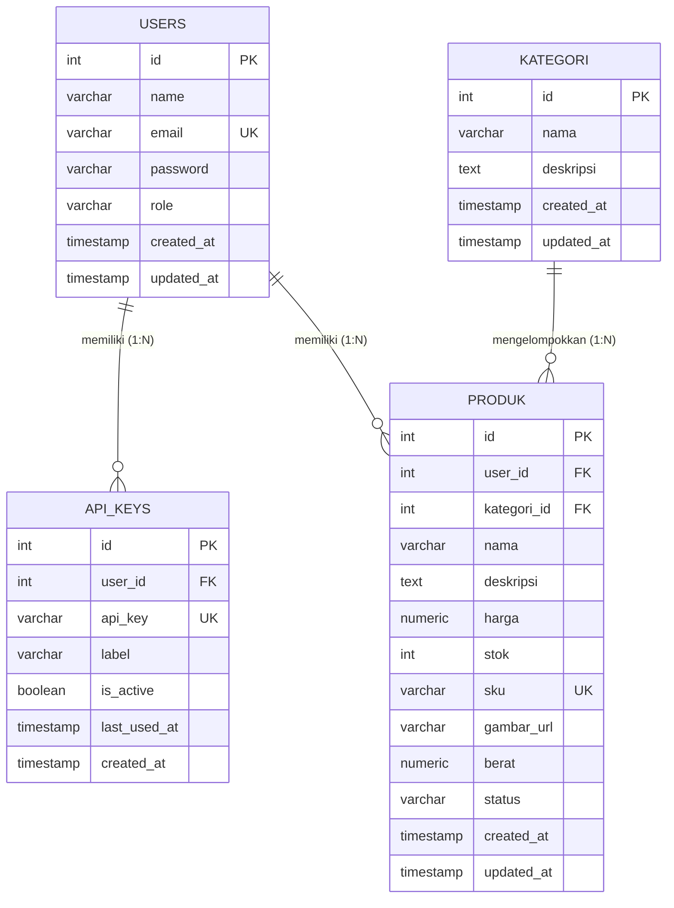
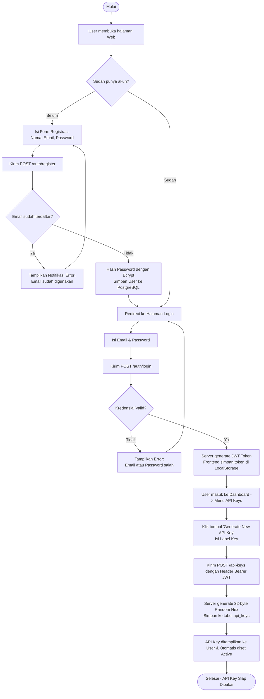
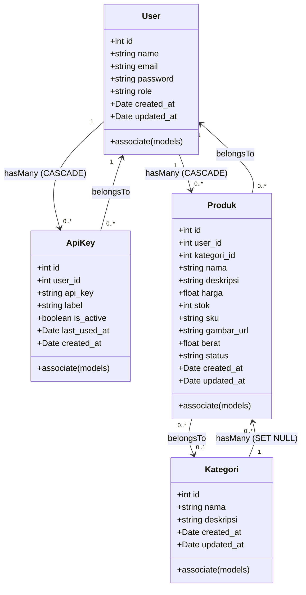
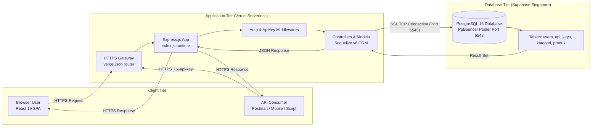

# LAPORAN TUGAS AKHIR
## PENGEMBANGAN WEB SERVIS

---

# **CommerceAPI: Perancangan dan Implementasi SaaS API Gateway untuk Penyediaan Data Produk E-Commerce Berbasis Dual-Layer Authentication**

<br>

**Disusun Oleh:**
* **Nama:** Ahmad Rassya Maulana
* **NIM:** 20250140157
* **Mata Kuliah:** Pengembangan Web Servis
* **Tahun Akademik:** 2025/2026 (Semester Antara)

---

### **Tautan Proyek & Live Deployment:**
* **Repositori GitHub:** [https://github.com/rrassya19-bit/FinalProject_157_Commerce-API](https://github.com/rrassya19-bit/FinalProject_157_Commerce-API)

* **Link Demo Frontend:** [https://commerceapi-frontend.vercel.app](https://commerceapi-frontend.vercel.app)
* **Live API Backend Server (Vercel):** [https://commerce-api-backend.vercel.app](https://commerce-api-backend.vercel.app)
* **Link Laporan Google Drive:** [https://drive.google.com/drive/folders/1_n1CPKG8MByAwMm9OX9gIsy0PhCt-0Dt?usp=sharing](https://drive.google.com/drive/folders/1_n1CPKG8MByAwMm9OX9gIsy0PhCt-0Dt?usp=sharing)
* **Database Host:** PostgreSQL (Supabase Cloud, Region Singapore, SSL Connection Pooler Port 6543)

---

## 📋 DAFTAR ISI

1. [Abstrak / Ringkasan Eksekutif](#abstrak--ringkasan-eksekutif)
2. [BAB I: Pendahuluan](#bab-i-pendahuluan)
   - 1.1 Latar Belakang
   - 1.2 Rumusan Masalah
   - 1.3 Batasan Masalah & Ruang Lingkup
   - 1.4 Tujuan & Manfaat Proyek
3. [BAB II: Landasan Teori & Konsep Arsitektur](#bab-ii-landasan-teori--konsep-arsitektur)
   - 2.1 Konsep Software as a Service (SaaS) & API Gateway
   - 2.2 Arsitektur Dual-Layer Authentication (JWT vs API Key)
   - 2.3 Prinsip Desain RESTful API & Protokol HTTP
   - 2.4 Database Relasional & Object-Relational Mapping (ORM)
   - 2.5 Serverless Computing & Database Connection Pooling
4. [BAB III: Perancangan Sistem (System Design)](#bab-iii-perancangan-sistem-system-design)
   - 3.1 Arsitektur Sistem Menyeluruh
   - 3.2 Perancangan Basis Data (4 Tabel Relasional)
   - 3.3 Entity Relationship Diagram (ERD)
   - 3.4 Use Case Diagram & Analisis Skenario Aktor
   - 3.5 Activity Diagram / Userflow Sistem
   - 3.6 Class Diagram (Sequelize Models)
   - 3.7 Deployment Diagram
5. [BAB IV: Implementasi Sistem](#bab-iv-implementasi-sistem)
   - 4.1 Tech Stack & Dependensi Proyek
   - 4.2 Struktur Direktori Monorepo
   - 4.3 Implementasi Backend & Middleware Keamanan
   - 4.4 Implementasi Frontend SPA Dashboard
   - 4.5 Konfigurasi Serverless Vercel & Penanganan SSL Database
6. [BAB V: Panduan Penggunaan Sistem (User & Developer Manual)](#bab-v-panduan-penggunaan-sistem-user--developer-manual)
   - 5.1 Panduan Bagi Pengguna / Seller (Dashboard Web)
   - 5.2 Panduan Bagi Pengembang / Developer (Integrasi API Eksternal)
7. [BAB VI: Spesifikasi Endpoint & Hasil Pengujian (Testing Matrix)](#bab-vi-spesifikasi-endpoint--hasil-pengujian-testing-matrix)
   - 6.1 Spesifikasi Lengkap 12 Endpoint RESTful API
   - 6.2 Matriks Pengujian Postman (15 Skenario Uji)
   - 6.3 Dokumentasi Hasil Uji Coba Visual
8. [BAB VII: Kesimpulan & Saran](#bab-vii-kesimpulan--saran)
   - 7.1 Kesimpulan Capaian Proyek
   - 7.2 Saran & Rencana Pengembangan Masa Depan
9. [Lampiran](#lampiran)
   - Lampiran 1: Skrip DDL Database (`01_schema.sql`)
   - Lampiran 2: Skrip Data Awal 50 Produk & 10 Kategori (`02_seed_data.sql`)
   - Petunjuk Konversi Dokumen ke Word / PDF

---

## ABSTRAK / RINGKASAN EKSEKUTIF

### **Abstrak (Bahasa Indonesia)**
Pertumbuhan ekosistem *e-commerce* dan integrasi multi-platform (aplikasi mobile, situs agregator, sistem POS, dan analitik) menuntut ketersediaan layanan data produk yang aman, terstandarisasi, dan mudah diakses oleh pihak ketiga tanpa membuka celah keamanan pada basis data internal. Proyek **CommerceAPI** dibangun sebagai solusi **Software as a Service (SaaS) API Gateway** yang menyediakan akses terprogram untuk operasi *Create, Read, Update, Delete* (CRUD) pada katalog produk dan kategori melalui otentikasi **API Key** unik, mengadopsi model layanan modern layaknya *OpenRouter* atau *WeatherAPI*. 

Sistem ini mengimplementasikan arsitektur keamanan berlapis (*Dual-Layer Authentication*): **JSON Web Token (JWT)** untuk mengamankan sesi portal web dan manajemen API key pengguna, serta **API Key** berbasis *cryptographic random token* yang disematkan pada header `x-api-key` untuk otorisasi mesin-ke-mesin. Sistem dibangun menggunakan backend **Node.js** dan **Express.js**, ORM **Sequelize**, basis data **PostgreSQL** di cloud **Supabase** (dengan enkripsi SSL), serta antarmuka web modern berbasis **React 19**, **Vite**, **Tailwind CSS v4**, dan **Framer Motion**. Layanan backend dideploy secara *serverless* pada platform **Vercel**. Proyek ini menyediakan 50 data produk awal yang terbagi ke dalam 10 kategori, serta dilengkapi fitur interaktif *Developer Hub* berupa **Dokumentasi API** dan **Live API Sandbox Playground**. Pengujian fungsionalitas seluruh endpoint menggunakan Postman menunjukkan tingkat keberhasilan 100% dengan respons HTTP status code yang valid.

**Kata Kunci:** *SaaS API Gateway, Web Service, RESTful API, Dual-Layer Authentication, JWT, API Key, Express.js, PostgreSQL, Supabase, Vercel.*

---

### **Abstract (English)**
*The rapid growth of the e-commerce ecosystem and multi-platform integrations (mobile applications, aggregator platforms, POS systems, and analytics engines) demands secure, standardized, and programmatic product catalog data services without exposing internal database infrastructures. The **CommerceAPI** project is engineered as a **Software as a Service (SaaS) API Gateway** that delivers programmatic Create, Read, Update, and Delete (CRUD) operations on product and category catalogs via unique **API Keys**, mirroring the architectural paradigm of industry-standard gateways such as OpenRouter or WeatherAPI.*

*The system establishes a robust Dual-Layer Authentication model: **JSON Web Tokens (JWT)** for securing user portal sessions and API key lifecycle management, and cryptographic **API Keys** transmitted via the `x-api-key` HTTP header for machine-to-machine data consumption. The tech stack comprises **Node.js** and **Express.js** for the backend engine, **Sequelize ORM**, cloud-hosted **PostgreSQL** on **Supabase** (enforced with SSL pooling), and a responsive client dashboard built with **React 19**, **Vite**, **Tailwind CSS v4**, and **Framer Motion**. The application is deployed as serverless functions on **Vercel**. Featuring a pre-seeded dataset of 50 comprehensive products across 10 categories, the platform also integrates an interactive Developer Hub with Live API Documentation and an in-browser Sandbox Playground. Comprehensive endpoint validation via Postman confirmed a 100% operational success rate.*

**Keywords:** *SaaS API Gateway, Web Service, RESTful API, Dual-Layer Authentication, JWT, API Key, Express.js, PostgreSQL, Supabase, Vercel.*

---

## BAB I: PENDAHULUAN

### 1.1 Latar Belakang
Di era transformasi digital saat ini, pertukaran data antar-sistem (*interoperability*) merupakan tulang punggung pengembangan aplikasi modern. Pada domain perdagangan digital (*e-commerce*), data katalog produk (seperti nama barang, SKU, harga, stok, berat, status ketersediaan, dan gambar) tidak hanya dikonsumsi oleh satu situs web toko online, melainkan harus dapat didistribusikan ke berbagai kanal penjualan lain, seperti aplikasi mobile Android/iOS, mitra marketplace, sistem Point of Sale (POS) di gerai fisik, maupun aplikasi pihak ketiga.

Memberikan akses langsung (*direct access*) ke database internal kepada pengembang aplikasi luar memiliki risiko keamanan yang sangat tinggi, rentan terhadap kebocoran data (*data breach*), dan sulit untuk dimonitor. Oleh karena itu, pendekatan terbaik dalam industri perangkat lunak adalah menyediakan **API Gateway** bergaya **Software as a Service (SaaS)**. 

Terinspirasi dari arsitektur platform penyedia API terkemuka seperti **OpenRouter** (yang mengagregasi model kecerdasan buatan lewat satu API key) atau **WeatherAPI** (yang mendistribusikan data cuaca lewat API key), proyek **CommerceAPI** dirancang untuk menyediakan layanan distribusi data produk e-commerce secara terprogram. Melalui platform ini, penjual (*seller*) dapat mengelola katalog mereka melalui dashboard web, kemudian men-generate API key yang dapat diberikan kepada pengembang aplikasi luar untuk melakukan integrasi data secara aman, terkontrol, dan terisolasi.

### 1.2 Rumusan Masalah
Berdasarkan latar belakang tersebut, perumusan masalah dalam proyek ini adalah:
1. Bagaimana merancang arsitektur web service yang memisahkan otentikasi akun pengguna web (dashboard) dengan otorisasi akses data terprogram mesin-ke-mesin (*machine-to-machine*)?
2. Bagaimana membangun RESTful API yang mendukung operasi CRUD penuh pada entitas kategori dan produk dengan skema relasional, filtering, dan pagination yang efisien?
3. Bagaimana mengintegrasikan basis data cloud PostgreSQL (Supabase) dengan Express.js dan Sequelize dalam lingkungan serverless hosting Vercel tanpa kendala sertifikat SSL?
4. Bagaimana merancang antarmuka dashboard interaktif yang menyediakan Developer Hub berupa Dokumentasi API dan Live Sandbox Playground untuk menguji request langsung di browser?

### 1.3 Batasan Masalah & Ruang Lingkup
Batasan masalah dan ruang lingkup pengembangan CommerceAPI meliputi:
1. **Format Pertukaran Data:** Semua komunikasi data request dan response menggunakan format standar **JSON** (*JavaScript Object Notation*).
2. **Skema Autentikasi:** Menerapkan otentikasi ganda:
   - **JWT (JSON Web Token)** dengan masa kedaluwarsa 1 hari untuk endpoint `/auth` dan `/api-keys`.
   - **API Key** (32-byte cryptographic random string hex) disematkan pada custom HTTP header `x-api-key` untuk endpoint `/api/v1/kategori` dan `/api/v1/produk`.
3. **Kapasitas Dataset Awal:** Disediakan dataset awal minimal **50 data produk** yang terbagi rapi ke dalam **10 kategori** dengan atribut kompleks (SKU unik, harga desimal, stok, berat gram, status ketersediaan, deskripsi, gambar URL, dan timestamp).
4. **Infrastruktur & Hosting:** 
   - Backend Express.js dideploy sebagai *Serverless Function* pada platform **Vercel**.
   - Basis data di-hosting pada **Supabase PostgreSQL** (Region Singapore).
   - Pengujian fungsionalitas dilakukan menggunakan **Postman**.

### 1.4 Tujuan & Manfaat Proyek
**Tujuan Proyek:**
1. Memenuhi seluruh kriteria dan rubrik penilaian Tugas Akhir mata kuliah Pengembangan Web Servis (NIM: 20250140157).
2. Mengimplementasikan standar industri dalam perancangan RESTful API, Object-Relational Mapping (ORM), dan keamanan web service.
3. Menghadirkan prototype SaaS API Gateway yang berfungsi penuh dari proses pendaftaran akun hingga konsumsi data oleh aplikasi eksternal.

**Manfaat Proyek:**
* **Bagi Pengembang Aplikasi (API Consumer):** Memperoleh akses data produk e-commerce yang cepat, terstruktur, dan terstandarisasi hanya dengan satu baris header API Key tanpa proses handshake yang rumit.
* **Bagi Penjual (Seller):** Memiliki kontrol penuh atas kunci akses data mereka, memantau riwayat pemakaian kunci (`last_used_at`), dan dapat mencabut (*revoke*) akses kapan saja.
* **Bagi Dunia Akademik:** Menjadi referensi perancangan aplikasi web service modern berbasis Express.js, PostgreSQL Supabase, dan Vercel Serverless.

---

## BAB II: LANDASAN TEORI & KONSEP ARSITEKTUR

### 2.1 Konsep Software as a Service (SaaS) & API Gateway
Software as a Service (SaaS) adalah model distribusi perangkat lunak di mana vendor meng-hosting aplikasi dan menyediakannya kepada pelanggan melalui internet. Dalam konteks API Gateway, SaaS bertindak sebagai titik masuk tunggal (*single entry point*) yang mengelola perutean permintaan, otentikasi, validasi, dan penyajian data ke berbagai klien luar.

Analog dengan **OpenRouter** yang menjembatani klien dengan berbagai model AI melalui satu API key, **CommerceAPI** menjembatani klien (seperti mobile app e-commerce atau dashboard toko) dengan basis data produk melalui satu API key.

```
┌────────────────────────────────────────────────────────────────┐
│                    KLIEN / KONSUMEN API                        │
│         (Postman / Mobile App / Web / cURL / Python)           │
└───────────────────────────────┬────────────────────────────────┘
                                │ Request + Header 'x-api-key'
                                ▼
┌────────────────────────────────────────────────────────────────┐
│                  COMMERCEAPI - SaaS GATEWAY                    │
│     (Verifikasi API Key -> Validasi Input -> Query ORM)        │
└───────────────────────────────┬────────────────────────────────┘
                                │ Query SQL via SSL
                                ▼
┌────────────────────────────────────────────────────────────────┐
│                   SUPABASE POSTGRESQL CLOUD                    │
│             (Tabel: users, api_keys, kategori, produk)         │
└────────────────────────────────────────────────────────────────┘
```

### 2.2 Arsitektur Dual-Layer Authentication (JWT vs API Key)
Salah satu keunggulan utama CommerceAPI adalah penerapan otentikasi dua lapis yang disesuaikan dengan konteks pemanggil:

```
┌───────────────────────────────────────────────────────────────┐
│                      PENGGUNA / DEVELOPER                     │
└───────────────┬───────────────────────────────┬───────────────┘
                │                               │
        (1) Login Akun                  (2) Panggil Data API
                ▼                               ▼
    ┌───────────────────────┐       ┌───────────────────────┐
    │   Endpoint Manajemen  │       │     Endpoint Data     │
    │  /auth & /api-keys    │       │ /api/v1/produk|kategori│
    ├───────────────────────┤       ├───────────────────────┤
    │  Header:              │       │  Header:              │
    │  Authorization: Bearer│       │  x-api-key: <key>     │
    ├───────────────────────┤       ├───────────────────────┤
    │  Middleware:          │       │  Middleware:          │
    │  authMiddleware.js    │       │  apiKeyMiddleware.js  │
    └───────────────────────┘       └───────────────────────┘
```

**Tabel Komparasi Mendalam: JWT vs API Key**

| Parameter | JSON Web Token (JWT) | API Key |
|---|---|---|
| **Definisi** | Token terenkripsi *stateless* yang membawa *payload* data user. | String acak *cryptographic hex* unik yang tersimpan di database. |
| **Sumber Perolehan** | Dihasilkan saat login sukses (`POST /auth/login`). | Dibuat oleh user di dashboard (`POST /api-keys`). |
| **Masa Berlaku** | Terbatas (1 hari / *short-lived*). | Permanen sampai user mencabutnya (*revoked*). |
| **Lokasi Header HTTP** | `Authorization: Bearer <token>` | `x-api-key: <api_key>` |
| **Penyimpanan Server** | Tidak disimpan di database (hanya diverifikasi via secret). | Disimpan di tabel `api_keys` (kolom `api_key`, `is_active`). |
| **Tujuan Penggunaan** | Manajemen akun seller, generate key, hapus key. | Konsumsi endpoint katalog produk & kategori e-commerce. |
| **Aktor Pengguna** | Manusia / Seller via Browser Dashboard. | Mesin / Aplikasi Mobile / Script Bot / Server Eksternal. |
| **Analogi Nyata** | Login username/password ke dashboard OpenRouter. | API Key `sk-...` yang ditempelkan di kode program. |

### 2.3 Prinsip Desain RESTful API & Protokol HTTP
CommerceAPI menerapkan kaidah arsitektur REST (*Representational State Transfer*):
1. **Stateless:** Setiap permintaan dari klien harus memuat semua informasi yang diperlukan oleh server untuk memprosesnya. Server tidak menyimpan *session state* klien.
2. **Standard HTTP Methods:**
   - `GET`: Membaca data tanpa mengubah status (*safe & idempotent*).
   - `POST`: Membuat entitas baru di server.
   - `PUT`: Memperbarui seluruh/sebagian atribut entitas yang sudah ada.
   - `DELETE`: Menghapus entitas dari server.
3. **Format Respons Standar:** Semua endpoint mengembalikan struktur JSON seragam:
   ```json
   {
     "success": true,
     "message": "Pesan deskriptif keberhasilan",
     "data": { ... }
   }
   ```
4. **HTTP Status Codes yang Digunakan:**
   - `200 OK`: Permintaan berhasil diproses.
   - `201 Created`: Entitas baru berhasil dibuat (Register, Generate Key, Tambah Produk/Kategori).
   - `400 Bad Request`: Kesalahan validasi input klien (misal: harga bernilai negatif, email duplikat).
   - `401 Unauthorized`: Kredensial tidak valid, token JWT kedaluwarsa, atau `x-api-key` salah/inaktif.
   - `404 Not Found`: Entitas atau rute tidak ditemukan di database.
   - `500 Internal Server Error`: Terjadi kegagalan pemrosesan pada internal server atau koneksi database.

### 2.4 Database Relasional & Object-Relational Mapping (ORM)
Sistem menggunakan basis data relasional **PostgreSQL** yang dikelola melalui **Sequelize v6**.
- **Integritas Referensial (*Foreign Key Constraints*):**
  - Relasi `users (1) — (N) api_keys`: Diterapkan `ON DELETE CASCADE`. Jika akun user dihapus, seluruh API key miliknya otomatis terhapus demi keamanan.
  - Relasi `users (1) — (N) produk`: Diterapkan `ON DELETE CASCADE`.
  - Relasi `kategori (1) — (N) produk`: Diterapkan `ON DELETE SET NULL`. Jika kategori tertentu dihapus, produk yang bersangkutan tidak ikut terhapus, melainkan nilai `kategori_id` diset menjadi `NULL`.
- **Keunggulan Sequelize ORM:** Mencegah celah keamanan *SQL Injection* melalui parameterized query, mengotomatisasi pemetaan relasi antar model (`hasMany`, `belongsTo`), dan memudahkan migrasi skema.

### 2.5 Serverless Computing & Database Connection Pooling
Pada lingkungan hosting modern seperti Vercel, kode backend dijalankan sebagai *Serverless Function* yang bersifat *ephemeral* (instansiasi berjalan cepat saat ada request dan mati saat idle).
- **Tantangan Serverless:** Setiap pemanggilan fungsi berpotensi membuka koneksi TCP baru ke database PostgreSQL, yang dapat menyebabkan limit koneksi (*max connections*) database terlampaui.
- **Solusi Connection Pooling:** CommerceAPI menggunakan **Supabase Connection Pooler (PgBouncer)** pada port `6543` dengan opsi koneksi SSL `rejectUnauthorized: false` dan inisialisasi lazy connection di `backend/index.js` agar koneksi database stabil dan efisien.

---

## BAB III: PERANCANGAN SISTEM (SYSTEM DESIGN)

### 3.1 Arsitektur Sistem Menyeluruh
Arsitektur CommerceAPI memisahkan tanggung jawab sistem menjadi beberapa lapisan (*Separation of Concerns*):

```
┌─────────────────────────────────────────────────────────────────────────────┐
│                             CLIENT LAYER                                    │
│  - Browser Dashboard (React 19 SPA)                                         │
│  - API Consumer (Postman, Mobile App, cURL, Python, Flutter)                │
└──────────────────────────────────────┬──────────────────────────────────────┘
                                       │ HTTPS / JSON
                                       ▼
┌─────────────────────────────────────────────────────────────────────────────┐
│                           API GATEWAY LAYER (VERCEL)                        │
│  - index.js (CORS, JSON Parser, Error Handler)                              │
│  - authMiddleware (Validasi Bearer JWT)                                     │
│  - apiKeyMiddleware (Validasi x-api-key & Update last_used_at)               │
└──────────────────────────────────────┬──────────────────────────────────────┘
                                       │
                                       ▼
┌─────────────────────────────────────────────────────────────────────────────┐
│                          BUSINESS LOGIC / CONTROLLERS                       │
│  - authController     : register, login (Bcrypt hash & JWT Sign)            │
│  - apiKeyController   : generate (Crypto 32-byte), list, delete             │
│  - kategoriController : CRUD Kategori                                       │
│  - produkController   : CRUD Produk (Filter, Pagination, Validasi Stok/SKU) │
└──────────────────────────────────────┬──────────────────────────────────────┘
                                       │ Sequelize ORM Queries
                                       ▼
┌─────────────────────────────────────────────────────────────────────────────┐
│                        DATA PERSISTENCE LAYER                               │
│  - Supabase Cloud PostgreSQL Database (Singapore)                           │
│  - Tables: users, api_keys, kategori, produk                                │
└─────────────────────────────────────────────────────────────────────────────┘
```

### 3.2 Perancangan Basis Data (4 Tabel Relasional)

#### **1. Tabel `users`**
Menyimpan informasi identitas akun pengguna (seller/administrator).
| Nama Kolom | Tipe Data | Constraint | Keterangan |
|---|---|---|---|
| `id` | SERIAL | PRIMARY KEY | Identitas unik user (Auto Increment) |
| `name` | VARCHAR(100) | NOT NULL | Nama lengkap pengguna |
| `email` | VARCHAR(150) | NOT NULL, UNIQUE | Alamat email unik untuk login |
| `password` | VARCHAR(255) | NOT NULL | Hash password (dienkripsi bcrypt 10 rounds) |
| `role` | VARCHAR(20) | DEFAULT 'seller' | Peran pengguna (`seller` / `admin`) |
| `created_at` | TIMESTAMP | DEFAULT CURRENT_TIMESTAMP | Waktu pendaftaran akun |
| `updated_at` | TIMESTAMP | DEFAULT CURRENT_TIMESTAMP | Waktu pembaruan akun |

#### **2. Tabel `api_keys`**
Menyimpan token kunci akses API yang digenerate oleh user untuk konsumsi data luar.
| Nama Kolom | Tipe Data | Constraint | Keterangan |
|---|---|---|---|
| `id` | SERIAL | PRIMARY KEY | Identitas unik API Key |
| `user_id` | INTEGER | NOT NULL, FK $\rightarrow$ `users(id)` ON DELETE CASCADE | Pemilik API key |
| `api_key` | VARCHAR(255) | NOT NULL, UNIQUE | 64-karakter hex string unik |
| `label` | VARCHAR(100) | NULLABLE | Nama pengenal key (misal: *Key Toko Rassya*) |
| `is_active` | BOOLEAN | DEFAULT TRUE | Status keaktifan key |
| `last_used_at`| TIMESTAMP | NULLABLE | Timestamp kapan key terakhir dipakai call API |
| `created_at` | TIMESTAMP | DEFAULT CURRENT_TIMESTAMP | Waktu pembuatan key |

#### **3. Tabel `kategori`**
Menyimpan data klasifikasi kategori produk.
| Nama Kolom | Tipe Data | Constraint | Keterangan |
|---|---|---|---|
| `id` | SERIAL | PRIMARY KEY | Identitas unik kategori |
| `nama` | VARCHAR(100) | NOT NULL | Nama kategori barang |
| `deskripsi` | TEXT | NULLABLE | Penjelasan detail kategori |
| `created_at` | TIMESTAMP | DEFAULT CURRENT_TIMESTAMP | Waktu pembuatan kategori |
| `updated_at` | TIMESTAMP | DEFAULT CURRENT_TIMESTAMP | Waktu pembaruan kategori |

#### **4. Tabel `produk`**
Menyimpan data katalog produk komersial.
| Nama Kolom | Tipe Data | Constraint | Keterangan |
|---|---|---|---|
| `id` | SERIAL | PRIMARY KEY | Identitas unik produk |
| `user_id` | INTEGER | NOT NULL, FK $\rightarrow$ `users(id)` ON DELETE CASCADE | Seller pemilik produk |
| `kategori_id`| INTEGER | NULLABLE, FK $\rightarrow$ `kategori(id)` ON DELETE SET NULL | Kategori produk |
| `nama` | VARCHAR(150) | NOT NULL | Nama produk |
| `deskripsi` | TEXT | NULLABLE | Rincian deskripsi produk |
| `harga` | NUMERIC(12,2)| NOT NULL, CHECK $\ge 0$ | Harga produk dalam Rupiah |
| `stok` | INTEGER | NOT NULL, DEFAULT 0, CHECK $\ge 0$ | Jumlah stok barang |
| `sku` | VARCHAR(50) | UNIQUE, NULLABLE | Kode unik barang (*Stock Keeping Unit*) |
| `gambar_url` | VARCHAR(255) | NULLABLE | Tautan URL gambar produk |
| `berat` | NUMERIC(8,2) | NULLABLE | Berat barang dalam satuan gram |
| `status` | VARCHAR(20) | DEFAULT 'active' | Status (`active`, `inactive`, `out_of_stock`)|
| `created_at` | TIMESTAMP | DEFAULT CURRENT_TIMESTAMP | Waktu penambahan produk |
| `updated_at` | TIMESTAMP | DEFAULT CURRENT_TIMESTAMP | Waktu pembaruan produk |

---

### 3.3 Entity Relationship Diagram (ERD)



> 🖼️ *Bukti visual diagram tersimpan pada file:* **`docs/DIAGRAM/Screenshots_DIAGRAM/ERD.png`**

**Kaidah Relasi Antar Tabel:**
1. **`users` ke `api_keys` (One-to-Many):** Satu user dapat membuat banyak API Key untuk keperluan aplikasi yang berbeda-beda. Satu API Key hanya terikat pada satu user.
2. **`users` ke `produk` (One-to-Many):** Satu user (seller) memiliki banyak item produk katalog.
3. **`kategori` ke `produk` (One-to-Many):** Satu kategori menaungi banyak produk. Satu produk berelasi dengan satu kategori induk.

---

### 3.4 Use Case Diagram & Analisis Skenario Aktor

```mermaid
graph TB
    Guest([Guest / Pengguna Belum Login])
    Seller([Seller / Pengguna Terdaftar])
    APIConsumer([API Consumer / Aplikasi Luar])

    subgraph CommerceAPI System
        UC1[Register Akun]
        UC2[Login Akun]
        UC3[Generate API Key Baru]
        UC4[Melihat Daftar API Key]
        UC5[Revoke / Hapus API Key]
        UC6[Melihat Daftar & Detail Produk]
        UC7[Menambah Produk Baru]
        UC8[Mengubah Data Produk]
        UC9[Menghapus Produk]
        UC10[Melihat Daftar & Detail Kategori]
        UC11[Menambah Kategori Baru]
        UC12[Mengubah Data Kategori]
        UC13[Menghapus Kategori]
        UC14[Membuka Live Sandbox Playground]
    end

    Guest --> UC1
    Guest --> UC2

    Seller --> UC2
    Seller --> UC3
    Seller --> UC4
    Seller --> UC5
    Seller --> UC6
    Seller --> UC7
    Seller --> UC8
    Seller --> UC9
    Seller --> UC10
    Seller --> UC11
    Seller --> UC12
    Seller --> UC13
    Seller --> UC14

    APIConsumer --> UC6
    APIConsumer --> UC7
    APIConsumer --> UC8
    APIConsumer --> UC9
    APIConsumer --> UC10
    APIConsumer --> UC11
    APIConsumer --> UC12
    APIConsumer --> UC13

    UC3 -.include.-> UC2
    UC4 -.include.-> UC2
    UC5 -.include.-> UC2
```



> 🖼️ *Bukti visual diagram tersimpan pada file:* **`docs/DIAGRAM/Screenshots_DIAGRAM/UseCase.png`**

**Matriks Peran Aktor & Otorisasi Use Case:**

| No | Use Case | Aktor Utama | Mekanisme Autentikasi |
|---|---|---|---|
| 1 | Registrasi Akun Baru | Guest | Publik (Tanpa Auth) |
| 2 | Login Akun | Guest $\rightarrow$ Seller | Publik (Menghasilkan JWT) |
| 3 | Generate API Key Baru | Seller | Wajib JWT (`Authorization: Bearer <token>`) |
| 4 | Melihat List API Key | Seller | Wajib JWT (`Authorization: Bearer <token>`) |
| 5 | Revoke / Hapus API Key | Seller | Wajib JWT (`Authorization: Bearer <token>`) |
| 6 | Melihat Katalog Produk (Read) | API Consumer / Seller | Wajib API Key (`x-api-key: <key>`) |
| 7 | Tambah Produk Baru (Create) | API Consumer / Seller | Wajib API Key (`x-api-key: <key>`) |
| 8 | Update Data Produk (Update) | API Consumer / Seller | Wajib API Key (`x-api-key: <key>`) |
| 9 | Hapus Produk (Delete) | API Consumer / Seller | Wajib API Key (`x-api-key: <key>`) |
| 10 | Melihat Data Kategori (Read) | API Consumer / Seller | Wajib API Key (`x-api-key: <key>`) |
| 11 | Tambah Kategori Baru (Create)| API Consumer / Seller | Wajib API Key (`x-api-key: <key>`) |
| 12 | Update Kategori (Update) | API Consumer / Seller | Wajib API Key (`x-api-key: <key>`) |
| 13 | Hapus Kategori (Delete) | API Consumer / Seller | Wajib API Key (`x-api-key: <key>`) |
| 14 | Uji Live Request Playground | Seller / Developer | Otomatis via API Key aktif |

---

### 3.5 Activity Diagram / Userflow Sistem

#### **A. Activity Diagram 1: Alur Registrasi, Login & Pembuatan API Key**
Menggambarkan alur user dari pertama kali mendaftar akun hingga mendapatkan token API Key siap pakai.


> 🖼️ *Bukti visual diagram tersimpan pada file:* **`docs/DIAGRAM/Screenshots_DIAGRAM/Activity_Register_Login.png`**

---

#### **B. Activity Diagram 2: Alur Konsumsi Data CRUD Produk (via API Key)**
Menggambarkan bagaimana request eksternal diverifikasi oleh `apiKeyMiddleware` hingga data dikembalikan.

```mermaid
flowchart TD
    Start([Mulai]) --> A[Klien / Aplikasi Eksternal menyiapkan request<br/>dengan Header x-api-key]
    A --> B[Kirim Request ke Endpoint /api/v1/produk<br/>GET / POST / PUT / DELETE]
    B --> C{Middleware apiKeyMiddleware:<br/>Header x-api-key ada?}
    C -- Tidak --> D[Response 401 Unauthorized:<br/>Header x-api-key diperlukan]
    D --> EndFail([Selesai - Gagal])
    C -- Ya --> E{Cek Database:<br/>Key ada & is_active = true?}
    E -- Tidak --> F[Response 401 Unauthorized:<br/>API key tidak valid / nonaktif]
    F --> EndFail
    E -- Ya --> G[Update kolom last_used_at = NOW()]
    G --> H{Metode HTTP Request?}
    
    H -- GET --> I[Ambil data produk dari database<br/>Terapkan filter kategori, status, pagination]
    I --> Res200[Response 200 OK + Payload JSON]
    
    H -- POST --> J[Validasi Input:<br/>Nama wajib, Harga >= 0, Stok >= 0, SKU unik]
    J --> K{Input Valid?}
    K -- Tidak --> Res400[Response 400 Bad Request + Pesan Error]
    K -- Ya --> L[Simpan Produk Baru ke PostgreSQL]
    L --> Res201[Response 201 Created + Data Produk]
    
    H -- PUT --> M[Cari Produk berdasarkan ID]
    M --> N{Produk Ditemukan?}
    N -- Tidak --> Res404[Response 404 Not Found]
    N -- Ya --> O[Update Atribut Produk & Simpan]
    O --> Res200
    
    H -- DELETE --> P[Cari Produk berdasarkan ID]
    P --> Q{Produk Ditemukan?}
    Q -- Tidak --> Res404
    Q -- Ya --> R[Hapus Produk dari PostgreSQL]
    R --> Res200
    
    Res200 --> EndSuccess([Selesai - Berhasil])
    Res201 --> EndSuccess
    Res400 --> EndFail
    Res404 --> EndFail
```
> 🖼️ *Bukti visual diagram tersimpan pada file:* **`docs/DIAGRAM/Screenshots_DIAGRAM/Activity_CRUD_Produk.png`**

---

### 3.6 Class Diagram (Sequelize Models)


> 🖼️ *Bukti visual diagram tersimpan pada file:* **`docs/DIAGRAM/Screenshots_DIAGRAM/Class_Diagram.png`**

---

### 3.7 Deployment Diagram


> 🖼️ *Bukti visual diagram tersimpan pada file:* **`docs/DIAGRAM/Screenshots_DIAGRAM/Deployment_Diagram.png`**

---

## BAB IV: IMPLEMENTASI SISTEM

### 4.1 Tech Stack & Dependensi Proyek
Pengembangan CommerceAPI memanfaatkan ekosistem teknologi modern dengan efisiensi tinggi:

#### **A. Backend Stack (`backend/package.json`):**
* **Runtime & Framework:** Node.js & Express.js `v5.2.1`
* **Database Driver & ORM:** Sequelize `v6.37.8`, `pg` (PostgreSQL Client) `v8.23.0`, `pg-hstore` `v2.3.4`
* **Keamanan & Kriptografi:** `jsonwebtoken` `v9.0.3` (JWT sign & verify), `bcrypt` `v6.0.0` (salt hashing 10 rounds), Node.js `crypto` bawaan (32-byte hex generator).
* **Cross-Origin Resource Sharing:** `cors` `v2.8.6`
* **Environment Variables:** `dotenv` `v17.4.2`
* **Serverless Adapter:** `@vercel/node`

#### **B. Frontend Stack (`frontend/package.json`):**
* **Framework UI:** React 19 (`react`, `react-dom`)
* **Build Engine:** Vite `v8.2.2` & `@vitejs/plugin-react`
* **Routing:** React Router v7 (`react-router-dom`)
* **Styling System:** Tailwind CSS v4 (`@tailwindcss/vite`, `clsx`, `tailwind-merge`)
* **Motion & Animasi:** Framer Motion `v13.1.1` (transisi rute, hover interaction, mesh network)
* **HTTP Client:** Axios `v1.19.0` (dilengkapi Request Interceptor otomatis)
* **Internationalization:** `i18next` `v26.4.0` & `react-i18next` (Dukungan penuh Bahasa Indonesia & English)
* **Komponen Ikon & Notifikasi:** `lucide-react` `v1.33.0` & `react-hot-toast` `v2.6.0`

---

### 4.2 Struktur Direktori Monorepo
Struktur folder ditata secara modular memisahkan backend, frontend, dan dokumentasi:

```
FinalProject_157_Commerce-API/
├── backend/
│   ├── config/
│   │   └── config.js                # Konfigurasi koneksi Sequelize & SSL Supabase
│   ├── controller/
│   │   ├── authController.js        # Logika registrasi & login user
│   │   ├── apiKeyController.js      # Logika generate, list, & revoke API key
│   │   ├── kategoriController.js    # Logika CRUD kategori produk
│   │   └── produkController.js      # Logika CRUD produk (filter, paging, validasi)
│   ├── middleware/
│   │   ├── authMiddleware.js        # Verifikasi Authorization Bearer JWT
│   │   └── apiKeyMiddleware.js      # Verifikasi header x-api-key & auto timestamp
│   ├── models/
│   │   ├── index.js                 # Inisialisasi Sequelize, dialectModule pg, & relasi
│   │   ├── user.js                  # Model tabel users
│   │   ├── apiKey.js                # Model tabel api_keys
│   │   ├── kategori.js              # Model tabel kategori
│   │   └── produk.js                # Model tabel produk
│   ├── routes/
│   │   ├── auth.js                  # Routing /auth/register & /auth/login
│   │   ├── apiKeys.js               # Routing /api-keys
│   │   ├── kategori.js              # Routing /api/v1/kategori
│   │   └── produk.js                # Routing /api/v1/produk
│   ├── 01_schema.sql                # DDL skrip pembuatan struktur 4 tabel
│   ├── 02_seed_data.sql             # Data awal (10 kategori + 50 produk + sequence sync)
│   ├── .env.example                 # Template variabel backend
│   ├── index.js                     # Entry point Express.js app
│   ├── package.json
│   └── vercel.json                  # Konfigurasi build serverless backend
│
├── docs/
│   ├── DIAGRAM/
│   │   ├── Screenshots_DIAGRAM/     # File PNG: ERD, UseCase, Activity, Class, Deployment
│   │   ├── ERD.mmd
│   │   ├── UseCase.mmd
│   │   ├── Activity_Register_Login.mmd
│   │   ├── Activity_CRUD_Produk.mmd
│   │   ├── Class_Diagram.mmd
│   │   └── Deployment_Diagram.mmd
│   ├── Dokumentasi_Postman_Deploy_https=commerce-api-backend.vercel.app/  # 15 Screenshot Postman Live
│   ├── Dokumentasi_Postman_LocalHost_http=localhost3000/                 # 15 Screenshot Postman Local
│   └── DIAGRAM.md
│
├── frontend/
│   ├── public/                      # Favicon & SVG Icons
│   ├── src/
│   │   ├── api/                     # Axios instance & service API functions
│   │   ├── components/              # Layout (Sidebar, Topbar, Navbar), UI, & Shared
│   │   ├── context/                 # AuthContext & ThemeContext
│   │   ├── i18n/                    # Locale kamus Bahasa (id.json & en.json)
│   │   ├── layouts/                 # DashboardLayout & PublicLayout
│   │   ├── pages/                   # Dashboard, Produk, Kategori, ApiKeys, Docs, Playground
│   │   ├── App.jsx                  # Routing React Router v7 & ProtectedRoute
│   │   ├── index.css                # Tailwind CSS imports
│   │   └── main.jsx                 # Entry point React
│   ├── .env.example
│   ├── vercel.json                  # SPA routing rewrite rule Vercel
│   ├── package.json
│   └── vite.config.js
│
├── LAPORAN.md                       # Laporan Lengkap Proyek (File ini)
├── PERANCANGAN.md                   # Dokumen teknis arsitektur awal
└── README.md                        # Panduan ringkas repositori
```

---

### 4.3 Implementasi Backend & Middleware Keamanan

#### **1. Middleware Verifikasi JWT (`backend/middleware/authMiddleware.js`):**
Membaca token pada header `Authorization: Bearer <token>` dan memvalidasinya menggunakan `JWT_SECRET`. Token yang valid akan mengekstrak data user ke objek `req.user`.

#### **2. Middleware Verifikasi API Key (`backend/middleware/apiKeyMiddleware.js`):**
Membaca nilai `x-api-key`, mencari rekaman pada tabel `api_keys` dengan status `is_active = true`, memperbarui kolom `last_used_at = new Date()`, serta menyematkan identitas pemilik ke `req.apiKey` dan `req.user`.

#### **3. Penanganan Ekstraksi Error Sequelize:**
Pada `kategoriController.js` dan `produkController.js`, penanganan kesalahan dirancang untuk mengekstrak pesan spesifik (`error.errors[].message`) jika terjadi kesalahan validasi kolom atau bentrok keunikan SKU:
```javascript
const errorMsg = error.errors && error.errors.length > 0
  ? error.errors.map(e => e.message).join(', ')
  : error.message;
```

---

### 4.4 Implementasi Frontend SPA Dashboard

1. **State Management Terpusat (`AuthContext.jsx`):**
   - Mengelola sesi token JWT dan informasi pengguna.
   - Menyimpan `activeApiKey` pada `localStorage` sehingga ketika pengguna memilih salah satu kunci, seluruh pemanggilan data produk dan kategori secara otomatis menyertakan kunci tersebut.
2. **Axios Request Interceptor (`axiosInstance.js`):**
   - Otomatis menyuntikkan `Authorization: Bearer <token>` jika user sedang login.
   - Otomatis menyuntikkan `x-api-key: <activeApiKey>` pada setiap request data katalog.
3. **Developer Hub (Terintegrasi Penuh Dalam Dashboard):**
   - **Dokumentasi API (`/dashboard/docs`):** Menampilkan rincian seluruh endpoint, format request/response, dan tombol salin cepat.
   - **Live Sandbox Playground (`/dashboard/playground`):** Pengguna dapat memilih preset endpoint (GET, POST, PUT, DELETE), mengisi body JSON, dan mengirimkan request HTTP secara instan dengan penampil respons berwarna (*syntax highlighted & status-coded*).
4. **Desain Adaptif & Aksesibilitas:**
   - Mendukung **Dark Mode** dan **Light Mode** yang tersimpan di memori browser.
   - Mendukung pergantian bahasa dinamis **Bahasa Indonesia $\leftrightarrow$ English** via `i18next`.

---

### 4.5 Konfigurasi Serverless Vercel & Penanganan SSL Database
Untuk memastikan backend dapat berjalan sempurna di lingkungan serverless Vercel dan terhubung ke database cloud Supabase:
1. **Passing Eksplisit Driver PostgreSQL:** Di `backend/models/index.js` dan `backend/config/config.js`, disertakan opsi `dialectModule: require('pg')` agar bundler serverless Vercel tidak melakukan *tree-shake* pada driver database.
2. **Bypass Self-Signed Certificate:** Pada koneksi production Supabase, diterapkan `dialectOptions.ssl = { require: true, rejectUnauthorized: false }` dan sanitasi parameter URL koneksi agar koneksi aman terjamin tanpa terputus.
3. **Routing Rewrite SPA:** File `frontend/vercel.json` dikonfigurasi dengan rewrite rule `{"source": "/(.*)", "destination": "/index.html"}` agar navigasi rute React Router tidak menghasilkan error 404 saat browser di-refresh.

---

## BAB V: PANDUAN PENGGUNAAN SISTEM (USER & DEVELOPER MANUAL)

Panduan ini disusun secara sistematis agar pengguna baru, dosen penilai, maupun pengembang pihak ketiga dapat mengoperasikan CommerceAPI dengan mudah.

---

### 5.1 Panduan Bagi Pengguna / Seller (Dashboard Web)

```
[ Registrasi Akun ] ──> [ Login ] ──> [ Buat API Key ] ──> [ Tetapkan Active Key ] ──> [ Kelola Produk & Kategori ]
```

#### **Langkah 1: Membuat Akun Baru (Registrasi)**
1. Buka situs frontend CommerceAPI pada peramban web.
2. Pada halaman utama (*Landing Page*), klik tombol **"Mulai Sekarang"** atau **"Register"**.
3. Masukkan data:
   - **Nama Lengkap:** (Contoh: `Ahmad Rassya Maulana`)
   - **Alamat Email:** (Contoh: `rassya@commerceapi.com`)
   - **Password:** (Contoh: `password123`)
4. Klik tombol **Daftar Akun**. Sistem akan mengenkripsi password dengan bcrypt dan menyimpan user baru dengan role default `seller`.

---

#### **Langkah 2: Masuk ke Dashboard (Login)**
1. Buka halaman **Login**.
2. Masukkan alamat email dan password yang telah didaftarkan.
3. Klik tombol **Masuk**.
4. Setelah berhasil, server akan memberikan **JWT Token**. Frontend akan menyimpan sesi Anda secara aman dan mengarahkan Anda ke halaman utama **Dashboard**.

---

#### **Langkah 3: Membuat dan Memilih API Key (PENTING)**
Sebagai platform SaaS berbasis API Key, data katalog produk Anda diamankan di balik kunci akses. Agar data produk dan kategori tampil di dashboard, Anda perlu men-generate API key:

1. Pada menu sidebar sebelah kiri, klik menu **API Keys**.
2. Klik tombol **"+ Buat API Key Baru"** di pojok kanan atas.
3. Masukkan **Label / Nama Pengenal Kunci**:
   - *Tips Isian:* Beri nama yang mudah diingat, misalnya **`Toko Rassya Key`** atau **`Production Mobile Key`**.
4. Klik tombol **Generate Key**.
5. Sistem akan menampilkan kode API Key baru Anda (contoh: `c3f8b056e4c2780775d9e50c4a4e1d...`).
6. Klik tombol **Salin / Copy** jika ingin menyimpannya, lalu klik **Selesai**.
7. **Memilih Kunci Aktif (*Active Key*):**
   - Kunci yang baru dibuat akan otomatis ditandai sebagai **"Dipilih / Selected"** (dengan badge biru).
   - Jika Anda memiliki beberapa kunci, Anda dapat mengklik tombol **"Jadikan Aktif"** pada kunci yang ingin digunakan. Kunci aktif inilah yang akan otomatis dipakai dashboard untuk memanggil data produk Anda.
8. **Mencabut Kunci (*Revoke/Delete*):** Jika sebuah kunci sudah tidak aman, klik tombol ikon tempat sampah (*Revoke*) untuk menghapusnya permanen.

---

#### **Langkah 4: Mengelola Katalog Produk (CRUD Produk)**
1. Klik menu **Produk** pada sidebar. Seluruh daftar **50 produk awal** akan langsung tampil di tabel.
2. **Fitur Filter & Navigasi:**
   - Gunakan dropdown **Kategori** untuk memfilter barang (Elektronik, Fashion, Makanan, dll).
   - Gunakan filter **Status** (Active, Inactive, Out of Stock).
   - Gunakan kolom **Pencarian** untuk mencari nama barang atau SKU.
   - Gunakan navigasi **Pagination** di bawah tabel untuk berpindah halaman data.
3. **Menambah Produk Baru (Create):**
   - Klik tombol **"+ Tambah Produk"**.
   - Isi formulir: Nama Barang, Kategori, Harga (Rp), Stok, SKU (unik), Berat (gram), dan Gambar URL.
   - Klik **Simpan**. Produk baru akan tersimpan ke database.
4. **Mengubah Data Produk (Update):**
   - Klik ikon pensil (*Edit*) pada baris produk yang ingin diubah.
   - Perbarui harga, stok, atau deskripsi barang $\rightarrow$ klik **Perbarui**.
5. **Menghapus Produk (Delete):**
   - Klik ikon tempat sampah (*Hapus*) $\rightarrow$ konfirmasi dialog popup $\rightarrow$ data produk akan terhapus.

---

#### **Langkah 5: Mengelola Kategori Produk (CRUD Kategori)**
1. Klik menu **Kategori** pada sidebar untuk melihat daftar 10 kategori produk.
2. Klik tombol **"+ Tambah Kategori"** untuk membuat kategori baru (masukkan nama dan deskripsi).
3. Anda dapat mengedit nama kategori atau menghapus kategori yang sudah tidak digunakan.

---

#### **Langkah 6: Pengaturan Tampilan & Bahasa**
* **Dark / Light Mode:** Klik ikon matahari/bulan pada bilah atas (*Topbar*) untuk beralih antara tema gelap elegan dan tema terang bersih.
* **Ganti Bahasa (ID / EN):** Klik tombol bendera/bahasa di Topbar untuk beralih antara Bahasa Indonesia dan English secara instan.

---

### 5.2 Panduan Bagi Pengembang / Developer (Integrasi API Eksternal)

Pengembang pihak ketiga (aplikasi mobile, website lain, script otomatisasi) dapat mengonsumsi data CommerceAPI dengan sangat mudah:

#### **A. Menggunakan Dokumentasi API Bawaan (`/dashboard/docs`):**
Buka menu **Dokumentasi API** di sidebar. Halaman ini menyajikan katalog lengkap endpoint, metode HTTP, header yang wajib disertakan, contoh request body JSON, dan contoh response JSON.

#### **B. Menguji Request di Live API Sandbox Playground (`/dashboard/playground`):**
1. Buka menu **Playground** di sidebar.
2. Pilih salah satu tombol **Preset** (contoh: *GET List Produk* atau *POST Tambah Produk*).
3. Field `x-api-key` akan terisi otomatis dengan API Key aktif Anda.
4. Klik tombol **"Kirim Request"**.
5. Hasil respons server (JSON output, HTTP status code 200/201, dan waktu respons milidetik) akan langsung ditampilkan di layar browser tanpa memerlukan Postman.

#### **C. Memanggil API dari Aplikasi Luar (Postman / cURL / Code):**
Sertakan header `x-api-key` pada setiap request:

**Contoh 1: Menggunakan cURL (Terminal)**
```bash
curl -X GET "https://commerce-api-backend.vercel.app/api/v1/produk?limit=5" \
     -H "x-api-key: c3f8b056e4c2780775d9e50c4a4e1d..."
```

**Contoh 2: Menggunakan JavaScript (Fetch / Axios)**
```javascript
const response = await fetch('https://commerce-api-backend.vercel.app/api/v1/produk', {
  method: 'GET',
  headers: {
    'Content-Type': 'application/json',
    'x-api-key': 'c3f8b056e4c2780775d9e50c4a4e1d...'
  }
});
const data = await response.json();
console.log(data);
```

**Contoh 3: Menggunakan Python (Requests)**
```python
import requests

url = "https://commerce-api-backend.vercel.app/api/v1/produk"
headers = {
    "x-api-key": "c3f8b056e4c2780775d9e50c4a4e1d..."
}
response = requests.get(url, headers=headers)
print(response.json())
```

---

## BAB VI: SPESIFIKASI ENDPOINT & HASIL PENGUJIAN (TESTING MATRIX)

### 6.1 Spesifikasi Lengkap 12 Endpoint RESTful API

Base URL Production: `https://commerce-api-backend.vercel.app`

| No | Method | Endpoint URL | Autentikasi | Deskripsi Singkat |
|:---:|:---:|---|:---:|---|
| 1 | `POST` | `/auth/register` | Publik | Registrasi akun seller baru |
| 2 | `POST` | `/auth/login` | Publik | Login user & mendapatkan token JWT |
| 3 | `POST` | `/api-keys` | Bearer JWT | Generate API Key baru dengan label |
| 4 | `GET` | `/api-keys` | Bearer JWT | Mengambil seluruh daftar API Key user |
| 5 | `DELETE` | `/api-keys/:id` | Bearer JWT | Menghapus / me-revoke API Key tertentu |
| 6 | `GET` | `/api/v1/kategori` | `x-api-key` | Mengambil seluruh daftar kategori produk |
| 7 | `GET` | `/api/v1/kategori/:id` | `x-api-key` | Mengambil detail kategori beserta relasi produk |
| 8 | `POST` | `/api/v1/kategori` | `x-api-key` | Menambahkan kategori baru |
| 9 | `PUT` | `/api/v1/kategori/:id` | `x-api-key` | Mengubah nama/deskripsi kategori |
| 10 | `DELETE` | `/api/v1/kategori/:id` | `x-api-key` | Menghapus kategori |
| 11 | `GET` | `/api/v1/produk` | `x-api-key` | List produk (+ filter `kategori_id`, `status`, `page`, `limit`) |
| 12 | `GET` | `/api/v1/produk/:id` | `x-api-key` | Mengambil detail 1 produk |
| 13 | `POST` | `/api/v1/produk` | `x-api-key` | Menambahkan produk baru |
| 14 | `PUT` | `/api/v1/produk/:id` | `x-api-key` | Mengubah harga, stok, atau atribut produk |
| 15 | `DELETE` | `/api/v1/produk/:id` | `x-api-key` | Menghapus produk dari katalog |

---

### 6.2 Matriks Pengujian Postman (15 Skenario Uji)

Pengujian dilakukan secara menyeluruh terhadap server live deployment Vercel (`https://commerce-api-backend.vercel.app`). Seluruh 15 skenario berhasil dieksekusi dengan hasil valid:

| ID Uji | Skenario Pengujian | Method & Endpoint | Header yang Dikirim | Status Code | Hasil Pengujian |
|:---:|---|---|---|:---:|:---:|
| **TC-01** | Registrasi Akun Seller Baru | `POST /auth/register` | `Content-Type: application/json` | **`201 Created`** | **PASSED** (User ID terbuat, password ter-hash) |
| **TC-02** | Login Akun Seller | `POST /auth/login` | `Content-Type: application/json` | **`200 OK`** | **PASSED** (Token JWT berhasil didapatkan) |
| **TC-03** | Generate API Key Baru | `POST /api-keys` | `Authorization: Bearer <JWT>` | **`201 Created`** | **PASSED** (API key 64-hex terbuat) |
| **TC-04** | List Semua API Key User | `GET /api-keys` | `Authorization: Bearer <JWT>` | **`200 OK`** | **PASSED** (Array daftar API key muncul) |
| **TC-05** | Read All Kategori | `GET /api/v1/kategori` | `x-api-key: <API_KEY>` | **`200 OK`** | **PASSED** (Menampilkan 10 kategori seed) |
| **TC-06** | Read Detail Kategori | `GET /api/v1/kategori/1` | `x-api-key: <API_KEY>` | **`200 OK`** | **PASSED** (Detail kategori 1 + list produk terkait) |
| **TC-07** | Create Kategori Baru | `POST /api/v1/kategori` | `x-api-key: <API_KEY>` | **`201 Created`** | **PASSED** (Kategori baru ID #11 terbuat) |
| **TC-08** | Update Data Kategori | `PUT /api/v1/kategori/11` | `x-api-key: <API_KEY>` | **`200 OK`** | **PASSED** (Nama & deskripsi terupdate) |
| **TC-09** | Read All Produk (Filter & Paging) | `GET /api/v1/produk?page=1&limit=10` | `x-api-key: <API_KEY>` | **`200 OK`** | **PASSED** (Mengembalikan 10 produk per page) |
| **TC-10** | Read Detail Satu Produk | `GET /api/v1/produk/1` | `x-api-key: <API_KEY>` | **`200 OK`** | **PASSED** (Detail Galaxy X muncul lengkap) |
| **TC-11** | Create Produk Baru | `POST /api/v1/produk` | `x-api-key: <API_KEY>` | **`201 Created`** | **PASSED** (Produk baru ID #51 terbuat) |
| **TC-12** | Update Harga & Stok Produk | `PUT /api/v1/produk/51` | `x-api-key: <API_KEY>` | **`200 OK`** | **PASSED** (Harga & stok berhasil diperbarui) |
| **TC-13** | Delete Produk | `DELETE /api/v1/produk/51` | `x-api-key: <API_KEY>` | **`200 OK`** | **PASSED** (Produk ID 51 berhasil dihapus) |
| **TC-14** | Delete Kategori | `DELETE /api/v1/kategori/11` | `x-api-key: <API_KEY>` | **`200 OK`** | **PASSED** (Kategori ID 11 berhasil dihapus) |
| **TC-15** | Revoke / Hapus API Key | `DELETE /api-keys/1` | `Authorization: Bearer <JWT>` | **`200 OK`** | **PASSED** (API key dicabut & tidak bisa dipakai lagi) |

---

### 6.3 Dokumentasi Hasil Uji Coba Visual
Bukti tangkapan layar (*screenshot*) pengujian Postman telah tersusun rapi di dalam repositori:

1. **Folder Pengujian Server Live Deployment (Vercel):**
   `docs/Dokumentasi_Postman_Deploy_https=commerce-api-backend.vercel.app/`
   - `POST - Register User Baru.png`
   - `POST - Login User.png`
   - `POST - Generate API Key Baru.png`
   - `GET - List Semua API Key Milik User.png`
   - `GET - Ambil Semua Kategori (Read All).png`
   - `GET - Ambil Detail Kategori (Read Detail).png`
   - `POST - Tambah Kategori Baru (Create).png`
   - `PUT - Update Kategori (Update).png`
   - `GET - Ambil Semua Produk + Filter & Pagination (Read All).png`
   - `GET - Ambil Detail Satu Produk (Read Detail).png`
   - `POST - Tambah Produk Baru (Create).png`
   - `PUT - Update Produk (Update).png`
   - `DELETE - Hapus Produk (Delete).png`
   - `DELETE - Hapus Kategori (Delete).png`
   - `DELETE - Revoke Hapus API Key.png`

2. **Folder Pengujian Server Localhost:**
   `docs/Dokumentasi_Postman_LocalHost_http=localhost3000/`

---

## BAB VII: KESIMPULAN & SARAN

### 7.1 Kesimpulan Capaian Proyek
Berdasarkan perancangan, implementasi, dan serangkaian pengujian yang telah dilakukan, dapat disimpulkan bahwa:
1. **Pemenuhan Spesifikasi Tugas Akhir:** Proyek CommerceAPI telah memenuhi dan melampaui seluruh ketentuan yang ditetapkan:
   - Mengusung model **SaaS API Gateway** (analog OpenRouter / Weather API).
   - Memiliki **4 tabel relasional** (melebihi syarat minimal 2 tabel).
   - Menyediakan **50 data produk awal** pada **10 kategori** dengan kompleksitas atribut yang lengkap.
   - Menggunakan sistem otentikasi **JWT** pada manajemen akun dan **API Key** pada akses data.
   - Berhasil dideploy secara live di **Vercel** dan terkoneksi ke **PostgreSQL Supabase**.
2. **Kestabilan Arsitektur Dual-Layer Authentication:** Pemisahan antara token sesi JWT (1 hari) dengan API Key (permanen hingga direvoke) terbukti efektif dalam memberikan pengalaman pengguna yang ramah di dashboard sekaligus menjamin keamanan akses mesin eksternal.
3. **Kualitas Antarmuka & Aksesibilitas:** Dashboard SPA berbasis React 19 dan Tailwind CSS v4 memberikan performa responsif, mendukung dark/light mode, multi-bahasa, serta integrasi Developer Hub yang memudahkan pengujian langsung di browser.

### 7.2 Saran & Rencana Pengembangan Masa Depan
Untuk pengembangan sistem CommerceAPI pada versi berikutnya, disarankan penambahan beberapa fitur berikut:
1. **Rate Limiting & Throttling:** Mengintegrasikan Redis / Upstash untuk membatasi jumlah panggilan request per API Key (misal: maksimum 60 request/menit untuk akun gratis) guna mencegah serangan *Denial of Service* (DoS).
2. **Usage Analytics & Metrics Chart:** Menambahkan grafik visual di dashboard yang menampilkan tren volume pemanggilan API per hari, waktu respons rata-rata, dan status code distribusi request.
3. **Webhook Notifications:** Menyediakan fitur Webhook agar klien eksternal dapat menerima notifikasi otomatis saat terjadi perubahan stok atau penambahan produk baru secara *real-time*.

---

## LAMPIRAN

### Lampiran 1: Skrip DDL Database (`01_schema.sql`)
```sql
-- 01_schema.sql: Struktur Tabel CommerceAPI
DROP TABLE IF EXISTS produk CASCADE;
DROP TABLE IF EXISTS kategori CASCADE;
DROP TABLE IF EXISTS api_keys CASCADE;
DROP TABLE IF EXISTS users CASCADE;

-- Tabel 1: users
CREATE TABLE users (
    id SERIAL PRIMARY KEY,
    name VARCHAR(100) NOT NULL,
    email VARCHAR(150) NOT NULL UNIQUE,
    password VARCHAR(255) NOT NULL,
    role VARCHAR(20) DEFAULT 'seller',
    created_at TIMESTAMP DEFAULT CURRENT_TIMESTAMP,
    updated_at TIMESTAMP DEFAULT CURRENT_TIMESTAMP
);

-- Tabel 2: api_keys
CREATE TABLE api_keys (
    id SERIAL PRIMARY KEY,
    user_id INTEGER NOT NULL REFERENCES users(id) ON DELETE CASCADE,
    api_key VARCHAR(255) NOT NULL UNIQUE,
    label VARCHAR(100),
    is_active BOOLEAN DEFAULT TRUE,
    last_used_at TIMESTAMP,
    created_at TIMESTAMP DEFAULT CURRENT_TIMESTAMP
);

-- Tabel 3: kategori
CREATE TABLE kategori (
    id SERIAL PRIMARY KEY,
    nama VARCHAR(100) NOT NULL,
    deskripsi TEXT,
    created_at TIMESTAMP DEFAULT CURRENT_TIMESTAMP,
    updated_at TIMESTAMP DEFAULT CURRENT_TIMESTAMP
);

-- Tabel 4: produk
CREATE TABLE produk (
    id SERIAL PRIMARY KEY,
    user_id INTEGER NOT NULL REFERENCES users(id) ON DELETE CASCADE,
    kategori_id INTEGER REFERENCES kategori(id) ON DELETE SET NULL,
    nama VARCHAR(150) NOT NULL,
    deskripsi TEXT,
    harga NUMERIC(12,2) NOT NULL,
    stok INTEGER NOT NULL DEFAULT 0,
    sku VARCHAR(50) UNIQUE,
    gambar_url VARCHAR(255),
    berat NUMERIC(8,2),
    status VARCHAR(20) DEFAULT 'active',
    created_at TIMESTAMP DEFAULT CURRENT_TIMESTAMP,
    updated_at TIMESTAMP DEFAULT CURRENT_TIMESTAMP
);
```

---

### Lampiran 2: Skrip Data Awal 50 Produk & 10 Kategori (`02_seed_data.sql`)
```sql
-- 02_seed_data.sql: Sample Seed Data 10 Kategori & 50 Produk

-- Dummy user pemilik awal (Password 'password123' bcrypt hash)
INSERT INTO users (id, name, email, password, role, created_at, updated_at) VALUES 
(1, 'Admin Seller', 'seller@commerceapi.com', '$2b$10$B6SARqHvLdEvt4OwnRbyJeLcXphwvNlHTH01JdYWR7H9x4V8SWbyq', 'seller', NOW(), NOW())
ON CONFLICT (id) DO NOTHING;

-- 10 Kategori
INSERT INTO kategori (id, nama, deskripsi, created_at, updated_at) VALUES
(1, 'Elektronik', 'Peralatan elektronik, gadget, dan aksesoris teknologi', NOW(), NOW()),
(2, 'Pakaian Pria', 'Busana pria formal, casual, dan aksesoris', NOW(), NOW()),
(3, 'Pakaian Wanita', 'Busana wanita tren masa kini, gamis, dress, dan kasual', NOW(), NOW()),
(4, 'Makanan & Minuman', 'Produk kuliner, camilan, dan minuman kemasan', NOW(), NOW()),
(5, 'Kesehatan & Kecantikan', 'Skincare, suplemen, dan perlengkapan perawatan diri', NOW(), NOW()),
(6, 'Rumah Tangga', 'Peralatan dapur, dekorasi ruangan, dan furnitur', NOW(), NOW()),
(7, 'Olahraga & Outdoor', 'Perlengkapan fitness, camping, dan olahraga atletik', NOW(), NOW()),
(8, 'Otomotif', 'Aksesoris motor, mobil, helm, dan suku cadang', NOW(), NOW()),
(9, 'Buku & Alat Tulis', 'Buku referensi, novel, dan perlengkapan kantor/sekolah', NOW(), NOW()),
(10, 'Mainan & Hobi', 'Mainan anak, action figure, diecast, dan perkakas hobi', NOW(), NOW())
ON CONFLICT (id) DO NOTHING;

-- 50 Produk E-Commerce Lengkap
INSERT INTO produk (user_id, kategori_id, nama, deskripsi, harga, stok, sku, gambar_url, berat, status, created_at, updated_at) VALUES
(1, 1, 'Smartphone Galaxy X', 'Layar 6.7 inch AMOLED 120Hz, RAM 8GB, 256GB Storage', 7500000.00, 25, 'ELK-001', 'https://images.unsplash.com/photo-1511707171634-5f897ff02aa9', 200.0, 'active', NOW(), NOW()),
(1, 1, 'Laptop UltraSlim 14"', 'Intel Core i7 13th Gen, 16GB RAM, 512GB NVMe SSD', 14200000.00, 10, 'ELK-002', 'https://images.unsplash.com/photo-1496181133206-80ce9b88a853', 1400.0, 'active', NOW(), NOW()),
(1, 1, 'TWS Bluetooth ANC Headset', 'Active Noise Cancelling, battery up to 30 hours', 599000.00, 50, 'ELK-003', 'https://images.unsplash.com/photo-1590658268037-6bf12165a8df', 60.0, 'active', NOW(), NOW()),
(1, 1, 'Smartwatch Fitness Tracker', 'Heart rate monitor, SpO2, tahan air 5ATM', 850000.00, 30, 'ELK-004', 'https://images.unsplash.com/photo-1523275335684-37898b6baf30', 45.0, 'active', NOW(), NOW()),
(1, 1, 'Mechanical Keyboard RGB', 'Tenkeyless layout, Blue switch tactile, RGB backlit', 650000.00, 15, 'ELK-005', 'https://images.unsplash.com/photo-1587829741301-dc798b83add3', 850.0, 'active', NOW(), NOW()),
(1, 2, 'Kemeja Katun Pria Formal', 'Bahan katun adem reguler fit lengan panjang', 185000.00, 40, 'PKP-001', 'https://images.unsplash.com/photo-1602810318383-e386cc2a3ccf', 250.0, 'active', NOW(), NOW()),
(1, 2, 'Celana Jeans Denim Slim Fit', 'Bahan denim stretch nyaman dipakai sehari-hari', 275000.00, 35, 'PKP-002', 'https://images.unsplash.com/photo-1542272604-787c3835535d', 500.0, 'active', NOW(), NOW()),
(1, 2, 'Jaket Hoodie Fleece Basic', 'Bahan cotton fleece tebal dan hangat', 199000.00, 45, 'PKP-003', 'https://images.unsplash.com/photo-1556905055-8f358a7a47b2', 450.0, 'active', NOW(), NOW()),
(1, 2, 'Kaos Polos Cotton Combed 30s', 'Katun murni halus, menyerap keringat maksimal', 65000.00, 100, 'PKP-004', 'https://images.unsplash.com/photo-1521572267360-ee0c2909d518', 180.0, 'active', NOW(), NOW()),
(1, 2, 'Sepatu Sneakers Casual Canvas', 'Sole karet anti slip, model casual modern', 320000.00, 20, 'PKP-005', 'https://images.unsplash.com/photo-1549298916-b41d501d3772', 700.0, 'active', NOW(), NOW()),
(1, 3, 'Dress Motif Floral Elegant', 'Bahan sifon premium lembut dan tidak menerawang', 245000.00, 25, 'PKW-001', 'https://images.unsplash.com/photo-1572804013309-59a88b7e92f1', 300.0, 'active', NOW(), NOW()),
(1, 3, 'Blouse Casual Wanita Lengan Balon', 'Desain kekinian cocok untuk kerja maupun kuliah', 135000.00, 50, 'PKW-002', 'https://images.unsplash.com/photo-1564257631407-4deb1f99d992', 200.0, 'active', NOW(), NOW()),
(1, 3, 'Rok Plisket Premium Panjang', 'Bahan hyget super rempel rapi tidak gampang melar', 95000.00, 60, 'PKW-003', 'https://images.unsplash.com/photo-1583496661160-fb5886a0aaaa', 300.0, 'active', NOW(), NOW()),
(1, 3, 'Cardigan Rajut Oversize', 'Rajut tebal premium knitwear model Korea', 155000.00, 30, 'PKW-004', 'https://images.unsplash.com/photo-1434389677669-e08b4cac3105', 400.0, 'active', NOW(), NOW()),
(1, 3, 'Tas Selempang Wanita Kulit Sintetis', 'Model shoulder bag minimalis dan elegan', 189000.00, 40, 'PKW-005', 'https://images.unsplash.com/photo-1584917865442-de89df76afd3', 350.0, 'active', NOW(), NOW()),
(1, 4, 'Kopi Arabika Gayo Single Origin 250g', 'Biji kopi sangrai kualitas specialty cupping score tinggi', 85000.00, 75, 'MKM-001', 'https://images.unsplash.com/photo-1559056199-641a0ac8b55e', 250.0, 'active', NOW(), NOW()),
(1, 4, 'Keripik Tempe Renyah Gurih 200g', 'Keripik tempe olahan tradisional tanpa pengawet', 25000.00, 120, 'MKM-002', 'https://images.unsplash.com/photo-1621996346565-e3d5d6281691', 220.0, 'active', NOW(), NOW()),
(1, 4, 'Madu Hutan Murni 500ml', 'Madu alami asli dari lebah liar hutan tropis', 120000.00, 30, 'MKM-003', 'https://images.unsplash.com/photo-1587049352846-4a222e784d38', 650.0, 'active', NOW(), NOW()),
(1, 4, 'Matcha Green Tea Powder Premium 100g', 'Bubuk matcha murni impor Jepang untuk latte & baking', 99000.00, 45, 'MKM-004', 'https://images.unsplash.com/photo-1536256263959-770b48d82b0a', 120.0, 'active', NOW(), NOW()),
(1, 4, 'Granola Almond Cokelat Sehat 400g', 'Oatmeal panggang dengan madu, almond, dan dark chocolate', 68000.00, 50, 'MKM-005', 'https://images.unsplash.com/photo-1517093708454-e0c1a967f673', 420.0, 'active', NOW(), NOW()),
(1, 5, 'Facial Serum Niacinamide 10% 30ml', 'Mencerahkan kulit, memudarkan noda hitam, meratakan warna kulit', 115000.00, 60, 'KHB-001', 'https://images.unsplash.com/photo-1620916566398-39f1143ab7be', 100.0, 'active', NOW(), NOW()),
(1, 5, 'Sunscreen UV Shield SPF 50 PA++++ 50ml', 'Formula gel ringan tidak lengket bebas whitecast', 89000.00, 80, 'KHB-002', 'https://images.unsplash.com/photo-1598440947619-2c35fc9aa908', 90.0, 'active', NOW(), NOW()),
(1, 5, 'Moisturizer Gel Ceramide 50g', 'Memperbaiki skin barrier dan menjaga kelembaban kulit', 129000.00, 40, 'KHB-003', 'https://images.unsplash.com/photo-1608248597359-2503a45c76db', 120.0, 'active', NOW(), NOW()),
(1, 5, 'Gentle Foaming Cleanser 100ml', 'Sabun cuci muka low pH lembut tanpa membuat kulit kering', 75000.00, 70, 'KHB-004', 'https://images.unsplash.com/photo-1556228720-195a672e8a03', 150.0, 'active', NOW(), NOW()),
(1, 5, 'Hair Tonic Ginseng Anti Rontok 150ml', 'Menguatkan akar rambut dan menyuburkan pertumbuhan rambut', 65000.00, 55, 'KHB-005', 'https://images.unsplash.com/photo-1535585209827-a15fcdbc4c2d', 200.0, 'active', NOW(), NOW()),
(1, 6, 'Set Panci Masak Anti Lengket 5 Pcs', 'Bahan granit coating marble bebas PFOA dan tahan lama', 450000.00, 15, 'RMT-001', 'https://images.unsplash.com/photo-1584990347449-74d1a581e285', 2500.0, 'active', NOW(), NOW()),
(1, 6, 'Air Fryer Digital 4.5 Liter 800W', 'Menggoreng tanpa minyak sehat dan cepat matang merata', 680000.00, 12, 'RMT-002', 'https://images.unsplash.com/photo-1596797038530-2c107229654b', 3200.0, 'active', NOW(), NOW()),
(1, 6, 'Vacuum Cleaner Portable Handheld', 'Daya hisap kuat 12000Pa untuk kasur, sofa, dan mobil', 299000.00, 25, 'RMT-003', 'https://images.unsplash.com/photo-1558317374-067fb5f30001', 1100.0, 'active', NOW(), NOW()),
(1, 6, 'Lampu Meja LED Dimmable Touch', '3 tingkat keterangan, port USB charging praktis', 110000.00, 45, 'RMT-004', 'https://images.unsplash.com/photo-1507473885765-e6ed057f782c', 400.0, 'active', NOW(), NOW()),
(1, 6, 'Diffuser Aromaterapi Ultrasonik 500ml', 'Melembabkan udara dengan lampu LED warna-warni', 145000.00, 35, 'RMT-005', 'https://images.unsplash.com/photo-1608571423902-eed4a5ad8108', 500.0, 'active', NOW(), NOW()),
(1, 7, 'Matras Yoga Anti Slip 6mm NBR', 'Empuk dan nyaman untuk yoga, pilates, senam lantai', 115000.00, 40, 'OLH-001', 'https://images.unsplash.com/photo-1601925260368-ae2f83cf8b7f', 900.0, 'active', NOW(), NOW()),
(1, 7, 'Dumbbell Set Neoprene 2 x 3kg', 'Lapisan karet lembut tidak licin dan aman di lantai', 160000.00, 20, 'OLH-002', 'https://images.unsplash.com/photo-1584735935682-2f2b69dff9d2', 6000.0, 'active', NOW(), NOW()),
(1, 7, 'Tenda Camping Waterproof 4 Orang', 'Bahan polyester tahan air, double layer windproof', 490000.00, 10, 'OLH-003', 'https://images.unsplash.com/photo-1504280390367-361c6d9f38f4', 2800.0, 'active', NOW(), NOW()),
(1, 7, 'Botol Minum Olahraga 1 Liter BPA Free', 'Bahan tritan food grade dengan penanda waktu minum', 49000.00, 90, 'OLH-004', 'https://images.unsplash.com/photo-1602143407151-7111542de6e8', 200.0, 'active', NOW(), NOW()),
(1, 7, 'Raket Badminton Carbon Fiber', 'Ringan tarikan senar kuat hingga 30 LBS', 275000.00, 22, 'OLH-005', 'https://images.unsplash.com/photo-1613918108466-292b78a8ef95', 150.0, 'active', NOW(), NOW()),
(1, 8, 'Helm Motor Full Face SNI DOT', 'Busa lembut bisa dilepas, kaca visor anti gores', 380000.00, 18, 'OTO-001', 'https://images.unsplash.com/photo-1558981806-ec527fa84c39', 1500.0, 'active', NOW(), NOW()),
(1, 8, 'Oli Mesin Sintetis Mobil 10W-40 4L', 'Perlindungan maksimal mesin bensin terhadap panas tinggi', 360000.00, 25, 'OTO-002', 'https://images.unsplash.com/photo-1486006920555-c77dce18193b', 3800.0, 'active', NOW(), NOW()),
(1, 8, 'Pompa Ban Mobil Elektrik Digital 12V', 'Auto stop saat tekanan ban tercapai, display LED akurat', 215000.00, 30, 'OTO-003', 'https://images.unsplash.com/photo-1580273916550-e323be2ae537', 800.0, 'active', NOW(), NOW()),
(1, 8, 'Sarung Tangan Riding Touchscreen', 'Bahan breathable dengan protector knuckle kokoh', 85000.00, 50, 'OTO-004', 'https://images.unsplash.com/photo-1578632767115-351597cf2477', 150.0, 'active', NOW(), NOW()),
(1, 8, 'Cairan Pengkilap Body Mobil & Motor 250ml', 'Formula hydrophobic nano coating efek daun talas', 55000.00, 65, 'OTO-005', 'https://images.unsplash.com/photo-1607860108855-64acf2078ed9', 300.0, 'active', NOW(), NOW()),
(1, 9, 'Buku Pemrograman Web Modern Fullstack', 'Panduan lengkap JavaScript, Node.js, Express & React', 135000.00, 40, 'BKT-001', 'https://images.unsplash.com/photo-1544716278-ca5e3f4abd8c', 450.0, 'active', NOW(), NOW()),
(1, 9, 'Buku Desain Sistem & Arsitektur Cloud', 'Strategi merancang aplikasi skalabel dan reliabel', 155000.00, 30, 'BKT-002', 'https://images.unsplash.com/photo-1532012164546-f432f2e3777a', 500.0, 'active', NOW(), NOW()),
(1, 9, 'Notebook Kulit A5 Dotted Grid 160 Hal', 'Kertas tebal 100gsm tidak tembus tinta cocok untuk bullet journal', 58000.00, 80, 'BKT-003', 'https://images.unsplash.com/photo-1589829085413-56de8ae18c73', 300.0, 'active', NOW(), NOW()),
(1, 9, 'Gel Pen Set 12 Warna Pastel 0.5mm', 'Tinta lancar tidak mudah macet dan cepat kering', 42000.00, 95, 'BKT-004', 'https://images.unsplash.com/photo-1583485088034-697b5bc54ccd', 150.0, 'active', NOW(), NOW()),
(1, 9, 'Kalkulator Ilmiah Saintifik 240 Fungsi', 'Display 2 baris baterai tahan lama untuk pelajar & teknik', 98000.00, 35, 'BKT-005', 'https://images.unsplash.com/photo-1594980596870-8aa52a78d8cd', 220.0, 'active', NOW(), NOW()),
(1, 10, 'Action Figure Superhero Scale 1:12', 'Sendi artikulasi lengkap dilengkapi aksesoris tangan & senjata', 299000.00, 20, 'MH-001', 'https://images.unsplash.com/photo-1608889175123-8ee362201f81', 300.0, 'active', NOW(), NOW()),
(1, 10, 'Diecast Mobil Klasik Vintage 1:24', 'Bahan metal pintu dan kap mesin bisa dibuka rapi', 185000.00, 25, 'MH-002', 'https://images.unsplash.com/photo-1581235720704-06d3acfcb36f', 400.0, 'active', NOW(), NOW()),
(1, 10, 'Rubik Speedcube Magnetik 3x3', 'Putaran sangat licin, magnet kuat untuk kompetisi speedcubing', 85000.00, 45, 'MH-003', 'https://images.unsplash.com/photo-1568832359672-e36cf5d74f54', 120.0, 'active', NOW(), NOW()),
(1, 10, 'Board Game Strategi Keluarga Seru', 'Permainan papan taktik 2-4 pemain durasi 45 menit', 245000.00, 15, 'MH-004', 'https://images.unsplash.com/photo-1610890716171-6b1bb98ffd09', 950.0, 'active', NOW(), NOW()),
(1, 10, 'Puzzle 1000 Pcs Pemandangan Alam', 'Bahan karton presisi gambar tajam dan kaya warna', 125000.00, 30, 'MH-005', 'https://images.unsplash.com/photo-1587740896339-96a76170508d', 600.0, 'active', NOW(), NOW());

-- Sinkronisasi sequence
SELECT setval('users_id_seq', COALESCE((SELECT MAX(id) FROM users), 1));
SELECT setval('kategori_id_seq', COALESCE((SELECT MAX(id) FROM kategori), 1));
SELECT setval('produk_id_seq', COALESCE((SELECT MAX(id) FROM produk), 1));
SELECT setval('api_keys_id_seq', COALESCE((SELECT MAX(id) FROM api_keys), 1));
```
