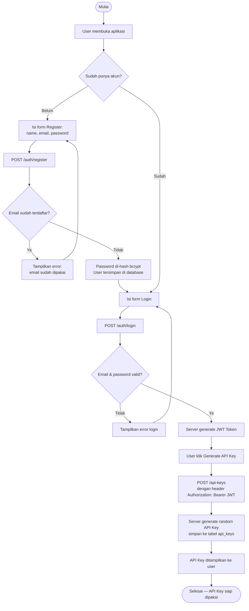
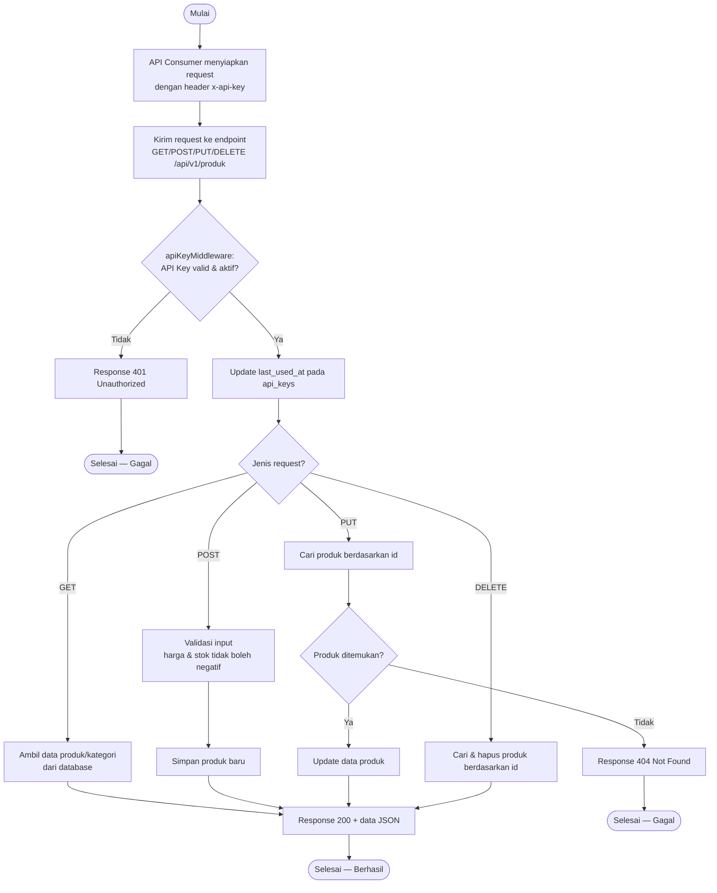
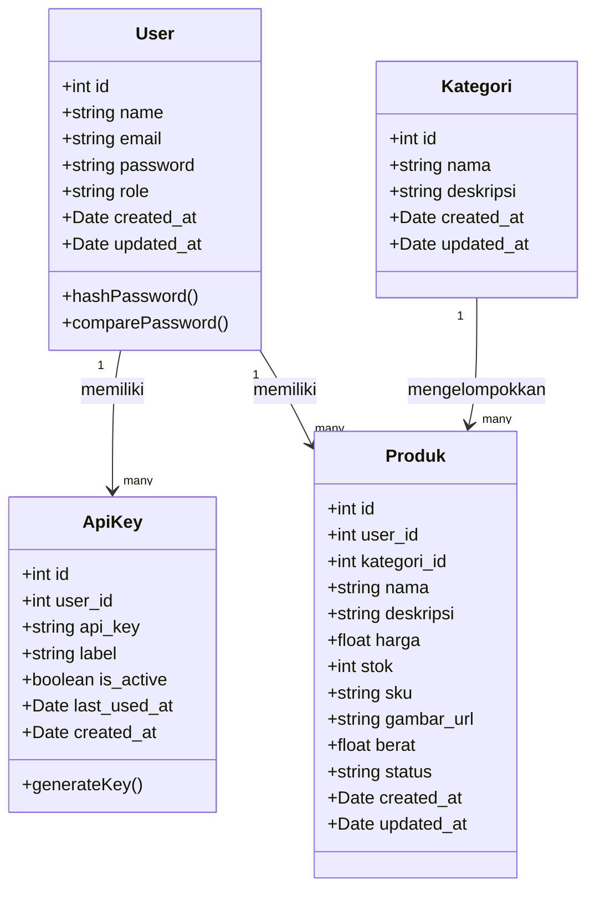
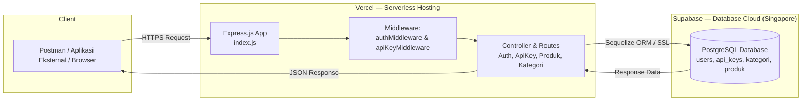

# DIAGRAM PERANCANGAN SISTEM — CommerceAPI

> Dokumen ini berisi seluruh diagram perancangan untuk laporan final project.
> Semua diagram ditulis dalam format **Mermaid** — bisa langsung di-preview di GitHub,
> VS Code (extension "Markdown Preview Mermaid Support"), atau situs mermaid.live
> untuk di-export jadi gambar (PNG/SVG) sebelum dimasukkan ke laporan PDF.

---

## 1. ERD (Entity Relationship Diagram)

```mermaid
erDiagram
    USERS ||--o{ API_KEYS : "memiliki"
    USERS ||--o{ PRODUK : "memiliki"
    KATEGORI ||--o{ PRODUK : "mengelompokkan"

    USERS {
        int id PK
        varchar name
        varchar email UK
        varchar password
        varchar role
        timestamp created_at
        timestamp updated_at
    }

    API_KEYS {
        int id PK
        int user_id FK
        varchar api_key UK
        varchar label
        boolean is_active
        timestamp last_used_at
        timestamp created_at
    }

    KATEGORI {
        int id PK
        varchar nama
        text deskripsi
        timestamp created_at
        timestamp updated_at
    }

    PRODUK {
        int id PK
        int user_id FK
        int kategori_id FK
        varchar nama
        text deskripsi
        numeric harga
        int stok
        varchar sku UK
        varchar gambar_url
        numeric berat
        varchar status
        timestamp created_at
        timestamp updated_at
    }
```



### Penjelasan relasi
- **`users` (1) — (N) `api_keys`**: satu user bisa punya banyak API key (misalnya key berbeda untuk aplikasi berbeda), tiap API key hanya milik satu user.
- **`users` (1) — (N) `produk`**: satu user (seller) bisa memiliki banyak produk.
- **`kategori` (1) — (N) `produk`**: satu kategori bisa menaungi banyak produk, satu produk hanya masuk satu kategori.

---

## 2. Use Case Diagram

### Aktor
1. **Guest (Pengguna belum login)** — hanya bisa register & login
2. **Seller (User sudah login)** — mengelola akun & API key miliknya
3. **API Consumer** — pihak eksternal (aplikasi lain/developer) yang mengakses data pakai API key

```mermaid
graph TB
    Guest([Guest])
    Seller([Seller])
    APIConsumer([API Consumer])

    UC1[Register Akun]
    UC2[Login]
    UC3[Generate API Key]
    UC4[Melihat Daftar API Key]
    UC5[Menghapus / Revoke API Key]
    UC6[Melihat Data Produk]
    UC7[Menambah Produk]
    UC8[Mengubah Produk]
    UC9[Menghapus Produk]
    UC10[Melihat Data Kategori]
    UC11[Menambah Kategori]
    UC12[Mengubah Kategori]
    UC13[Menghapus Kategori]

    Guest --> UC1
    Guest --> UC2

    Seller --> UC2
    Seller --> UC3
    Seller --> UC4
    Seller --> UC5

    APIConsumer --> UC6
    APIConsumer --> UC7
    APIConsumer --> UC8
    APIConsumer --> UC9
    APIConsumer --> UC10
    APIConsumer --> UC11
    APIConsumer --> UC12
    APIConsumer --> UC13

    UC3 -.include.-> UC2
    UC6 -.require.-> AuthKey[Validasi API Key]
    UC7 -.require.-> AuthKey
    UC8 -.require.-> AuthKey
    UC9 -.require.-> AuthKey
    UC10 -.require.-> AuthKey
    UC11 -.require.-> AuthKey
    UC12 -.require.-> AuthKey
    UC13 -.require.-> AuthKey
```



### Deskripsi singkat tiap use case
| Use Case | Aktor | Auth yang dibutuhkan |
|---|---|---|
| Register Akun | Guest | - |
| Login | Guest → jadi Seller | - |
| Generate API Key | Seller | JWT |
| Melihat/Menghapus API Key | Seller | JWT |
| CRUD Produk | API Consumer | x-api-key |
| CRUD Kategori | API Consumer | x-api-key |

> Catatan: "Seller" dan "API Consumer" secara teknis bisa jadi orang yang sama — seorang seller yang sudah generate API key otomatis berperan sebagai API Consumer saat memanggil endpoint data pakai key miliknya.

---

## 3. Activity Diagram / Userflow

### 3.1 Alur Registrasi & Generate API Key



### 3.2 Alur Konsumsi API (CRUD Produk)



---

## 4. Class Diagram (Model Sequelize)



---

## 5. Deployment Diagram



### Penjelasan arsitektur
1. **Client** mengirim request HTTPS ke domain Vercel (misal `https://commerceapi.vercel.app`)
2. **Vercel** menjalankan aplikasi Express sebagai serverless function, request masuk melalui `vercel.json` yang mengarahkan semua path ke `index.js`
3. Middleware memverifikasi JWT (untuk endpoint akun) atau API Key (untuk endpoint data)
4. Controller memproses request lalu berkomunikasi dengan **Supabase PostgreSQL** melalui Sequelize ORM dengan koneksi SSL
5. Response dikembalikan dalam format JSON standar: `{ success, message, data }`

---

## 6. Ringkasan Prinsip Desain yang Diterapkan

- **Separation of Concerns (pola MVC sederhana)**: struktur folder memisahkan `models` (struktur data), `controller` (logika bisnis), `routes` (definisi endpoint), dan `middleware` (autentikasi) — memudahkan maintenance.
- **Single Responsibility**: tiap controller hanya menangani satu entitas (auth, api-key, produk, kategori).
- **Layered Authentication**: dua lapis autentikasi berbeda konteks — JWT untuk manajemen akun/API key, API Key untuk konsumsi data — meniru pola nyata layanan SaaS seperti OpenRouter.

---

## Cara Export Diagram ke Gambar untuk Laporan PDF

1. Buka [mermaid.live](https://mermaid.live)
2. Copy salah satu blok kode di dalam ```` ```mermaid ... ``` ```` (tanpa tanda backtick-nya)
3. Paste ke editor di mermaid.live → diagram otomatis ter-render
4. Klik **Actions** → **Export as PNG/SVG**
5. Masukkan gambar hasil export ke laporan PDF kamu
